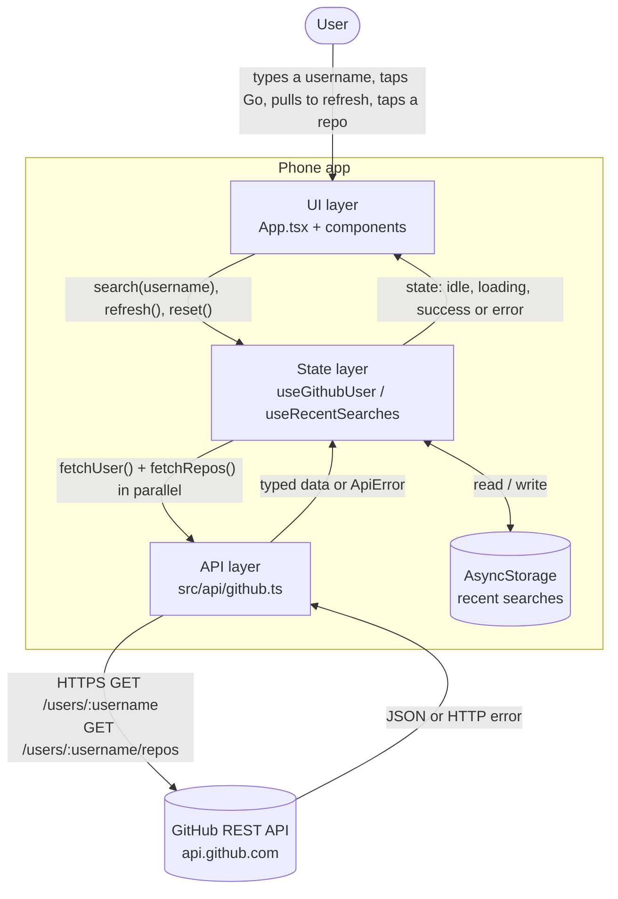
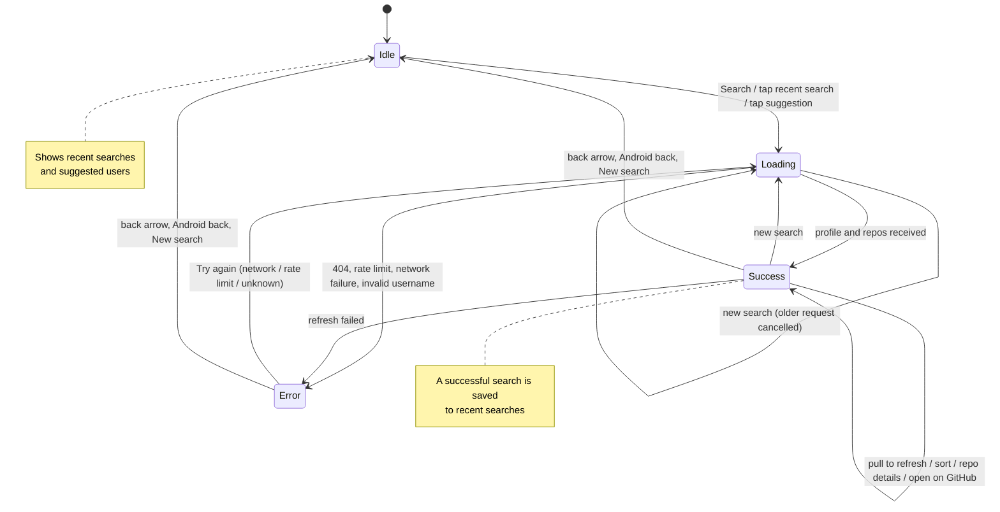
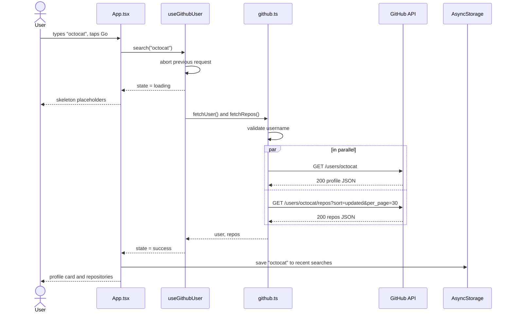

# GitHub Explorer

A React Native (Expo) mobile app for searching GitHub developers and exploring their public profiles and repositories. It uses the public [GitHub REST API](https://docs.github.com/en/rest).

<!-- Add real screenshots from your phone to docs/screenshots/ with these names -->
| Home | Profile | Repository details | Error |
|---|---|---|---|
|  |  |  |  |

---

## Features

### Required

- Search for a GitHub user by username
- Profile: avatar, name, username, bio, followers, following, public repository count
- A list of the user's public repositories with name, language and star count
- Loading, user-not-found and API-error states (network failure, rate limit, invalid username, unexpected errors)
- Start another search at any time (search bar, **New search** button, header back arrow or Android back gesture)

### UX additions

- **Sort repositories** by recently updated, most stars or name
- **Repository detail view** (bottom sheet): stars, forks, open issues, size, topics, license, default branch, dates and website
- **Open externally**: profile, repositories and websites open in an in-app browser tab; repositories can also be shared
- **Recent searches**: the last 6 successful searches, saved on the device, with remove and clear options
- **Pull-to-refresh** on the profile screen, with a "last updated" time
- Skeleton loading placeholders, fade-in animations, press feedback and haptic feedback
- Username check before calling the API (saves requests)
- Cancellation of outdated requests, so a slow old response never replaces a newer search
- Accessibility labels and roles on interactive elements

---

## Tech stack

| Area | Choice | Why |
|---|---|---|
| Framework | **React Native + Expo (SDK 57)** | Expo is the framework recommended by the React Native docs. It needs no native build setup to develop, runs on a real phone through Expo Go, and builds store binaries with EAS. |
| Language | **TypeScript (strict)** | Typed API responses and a typed state machine catch mistakes at compile time |
| Networking | Built-in `fetch` + `AbortController` | Only two GET endpoints are needed, so a library like axios or React Query adds little here |
| State | React hooks (`useState`, a custom hook) | A single screen with local state doesn't need Redux or Zustand |
| Storage | `@react-native-async-storage/async-storage` | Simple key–value storage for recent searches |
| UI | `StyleSheet`, `expo-linear-gradient`, `@expo/vector-icons` | Few dependencies and full control over the design |
| Links / feedback | `expo-web-browser`, `expo-haptics`, React Native `Share` | Native-feeling in-app browser, vibration and sharing |
| Tests | Jest + `jest-expo` | The testing setup recommended by Expo |

---

## Getting started

### Prerequisites

- [Node.js](https://nodejs.org/) LTS: 20.19.4+, 22.13+ or 24.3+ (required by React Native 0.86)
- Git
- One of:
  - the **Expo Go** app on an Android or iOS phone (easiest), **or**
  - an Android emulator (Android Studio) or iOS Simulator (macOS only)

### Install and run

```bash
git clone https://github.com/<your-username>/github-explorer.git
cd github-explorer
npm install
npx expo start
```

Then do one of these:

- **Phone:** open Expo Go and scan the QR code shown in the terminal. The phone and computer must be on the same Wi-Fi. If the connection fails, run `npx expo start --tunnel`.
- **Android emulator:** press `a` in the terminal.
- **iOS simulator (macOS):** press `i`.

### Useful scripts

| Command | What it does |
|---|---|
| `npm start` | Starts the Expo development server |
| `npm test` | Runs the unit tests |
| `npm run typecheck` | Runs the TypeScript compiler without emitting files |

### Build an installable Android APK (optional)

This uses [EAS Build](https://docs.expo.dev/build/introduction/), Expo's cloud build service. You need a free Expo account.

```bash
npm install -g eas-cli
eas login
eas build -p android --profile preview
```

When the build finishes, EAS shows a link and a QR code for downloading the `.apk`. The `preview` profile in `eas.json` produces an APK. The `production` profile produces an Android App Bundle (`.aab`) for the Play Store.

---

## Project structure

```
.
├── App.tsx                     # Screen: picks what to render for each state
├── app.json                    # Expo app config (name, icons, Android package)
├── eas.json                    # EAS Build profiles (APK preview, store production)
└── src/
    ├── api/
    │   ├── github.ts           # The only module that talks to GitHub; typed errors
    │   └── __tests__/          # API tests (error mapping, cancellation, request URLs)
    ├── hooks/
    │   ├── useGithubUser.ts    # Search state machine, cancellation, refresh
    │   └── useRecentSearches.ts# Recent searches saved with AsyncStorage
    ├── components/             # Presentational UI components
    │   ├── HeroHeader.tsx, SearchBar.tsx, ProfileCard.tsx, RepoItem.tsx,
    │   ├── RepoDetailSheet.tsx, SortTabs.tsx, RecentSearches.tsx, UserChip.tsx,
    │   └── StatusView.tsx, Skeleton.tsx, FadeIn.tsx, PressableScale.tsx
    ├── utils/                  # Pure helpers (sorting, formatting, colours, links, haptics)
    │   └── __tests__/          # Helper tests (sorting, formatting)
    └── theme.ts                # Colours, spacing, radii, shadows
```

---

## Architecture

### Layers

The UI never calls `fetch` directly. Data flows in one direction through three layers.



| Layer | Responsibility |
|---|---|
| **API** (`github.ts`) | Builds requests, checks the username, turns HTTP and network failures into a typed `ApiError` (`invalid_username`, `not_found`, `rate_limited`, `network`, `unknown`) |
| **State** (`useGithubUser`) | Holds one state value, runs both requests in parallel, cancels outdated requests, and supports refresh and reset |
| **UI** (`App.tsx`, components) | Renders whatever the current state needs and passes user actions to the hook. Components only display data and don't fetch. |

### State machine: user actions and screen states

The screen is always in exactly **one** of four states, modelled as a TypeScript discriminated union. This prevents impossible combinations such as "loading **and** showing an old error".



```ts
type SearchState =
  | { status: 'idle' }
  | { status: 'loading'; username: string }
  | { status: 'success'; username: string; user: GitHubUser; repos: Repo[]; fetchedAt: number }
  | { status: 'error'; username: string; error: ApiError };
```

### Sequence of a search



### Error handling

| Situation | Detected by | What the user sees |
|---|---|---|
| Invalid username format | Regex check before the request | "Invalid username" (no request is sent) |
| User doesn't exist | HTTP 404 | "User not found", with a hint to use the username rather than the display name |
| Rate limit exceeded | HTTP 429, or 403 with `x-ratelimit-remaining: 0` | "Too many searches", with the reset time from `x-ratelimit-reset` and a Try again button |
| No internet | `fetch` rejects | "No connection" with a Try again button |
| Anything else | Other non-2xx status | "Something went wrong (status)" with a Try again button |
| Outdated request | `AbortController` | Nothing. It's cancelled quietly. |

---

## Design decisions and trade-offs

| Decision | Alternatives considered | Reasoning |
|---|---|---|
| Expo (managed workflow) | Bare React Native CLI | Much faster setup, and development runs on a real phone through Expo Go. You can still add native code later with `npx expo prebuild`. |
| Single screen with a bottom-sheet modal | React Navigation / Expo Router with separate screens | For one main screen and one detail view, a modal plus explicit back handling is simpler and needs no navigation library. With more screens I'd use Expo Router. |
| `fetch` + custom hook | TanStack Query, axios | Two GET requests don't need a caching or query library. The hook still handles cancellation and refresh. TanStack Query would be the next step for caching, retries and pagination. |
| Discriminated-union state | Separate `isLoading` / `error` / `data` variables | Rules out impossible states, and TypeScript enforces the checks |
| `Promise.all` for profile + repos | Sequential requests | Faster, because both requests run at the same time. If one fails, the other is cancelled. |
| Details built from the repo list response | Extra `GET /repos/:owner/:repo` call | Opening details costs **zero** extra requests, which matters under the 60 requests/hour limit |
| First 30 repos, sorted by last update | Pagination / infinite scroll | Keeps the scope to a few hours. The UI states when only part of the list is shown. |
| No auth token | Personal access token | A token placed inside a mobile app can be extracted. The right fix is a small backend proxy (see Future improvements). |
| `cache: 'no-store'` and `Cache-Control: no-cache` | Default HTTP caching | Android's HTTP client cached GitHub responses, so profile edits didn't show until the cache expired. Always requesting fresh data fixes this. |
| In-app browser (`expo-web-browser`) | `Linking.openURL` | The user stays in the app. `Linking` is kept as a fallback. |
| `StyleSheet` + a small theme file | UI kit or Tailwind (NativeWind) | No extra build setup, and full control over the look |

---

## Assumptions

- Users search by **exact GitHub username** (the `login` in `github.com/<login>`), not by display name. Searching by name would need the `/search/users` endpoint, which has a stricter limit.
- Only **public** data is shown, and no sign-in is required.
- "Some of the user's public repositories" means the **30 most recently updated** repositories.
- The app is designed for phones in portrait orientation with a light theme.

## Known limitations

- **Rate limit:** without authentication, GitHub allows **60 requests per hour per IP address**. Each search uses 2 requests (profile + repositories). The app explains the limit and shows the reset time when it's reached.
- **No pagination:** users with more than 30 repositories only see the 30 most recently updated.
- **Sorting is client-side** and only applies to the loaded repositories.
- **Refresh failures** replace the current profile with the error screen instead of keeping the old data with a warning.
- **No offline cache:** previously viewed profiles aren't stored, only the usernames in Recent searches.
- **Light theme only;** no dark mode yet.
- **Tests cover pure logic and the API layer** (sorting, formatting, username checks, error mapping, cancellation). There are no component or end-to-end tests yet.
- `npm audit` reports moderate issues in development-only packages from the Expo toolchain. They aren't part of the app bundle. They weren't force-fixed, because `npm audit fix --force` would break Expo's version alignment.

## Future improvements

- A small **backend proxy** holding a GitHub token (5,000 requests/hour), plus caching
- **Pagination** / infinite scroll for repositories
- **TanStack Query** for caching, background refresh and retries
- **Dark mode** using `useColorScheme`
- **Search suggestions** while typing (`/search/users`, debounced)
- Component tests with React Native Testing Library, and end-to-end tests with Maestro
- Crash and error reporting (e.g. Sentry)

---

## How I used AI

I used an AI assistant (Claude) as a pair programmer and reviewer. I asked it to explain its reasoning and compare alternatives before accepting a suggestion. Some of the decisions I made along the way:

- **Tooling:** I started in Android Studio's *New Project* wizard, asked why it didn't fit a React Native task, and chose Expo + VS Code, keeping Android Studio only for the SDK.
- **Dev loop:** I rejected running an emulator (RAM limits) and an APK build per change (slow). I chose Expo Go on my phone for instant reloads, with one EAS-built APK at the end.
- **Architecture:** I asked for the API, state and UI layers to be separate, and had the assistant explain the discriminated-union state, request cancellation and `Promise.all` before using them.
- **Debugging:** my updated GitHub bio didn't appear. We traced it to Android's HTTP cache re-using GitHub responses and fixed it by requesting fresh data.
- **UX:** after trying the first version on my phone, I asked for a more polished design and for a back button (including Android's back gesture). I also chose a bottom sheet over adding a navigation library.
- **Scope:** I kept pagination, authentication and a backend out of scope and documented them above.
- **Verification:** every step was type-checked, the pure logic and API error handling were covered with unit tests, and each feature was tested manually on a real device.
